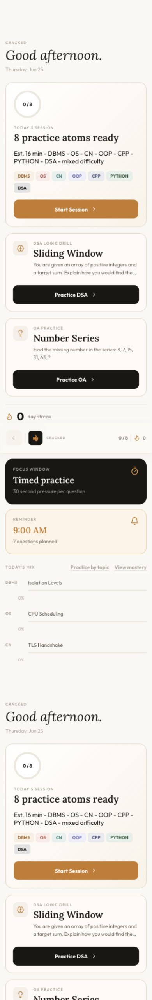
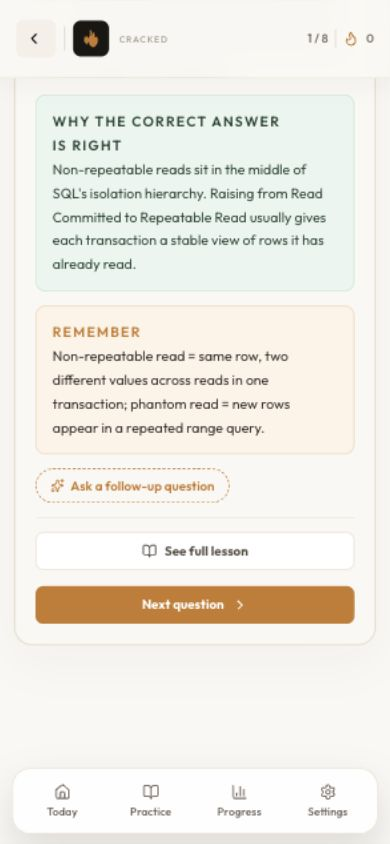
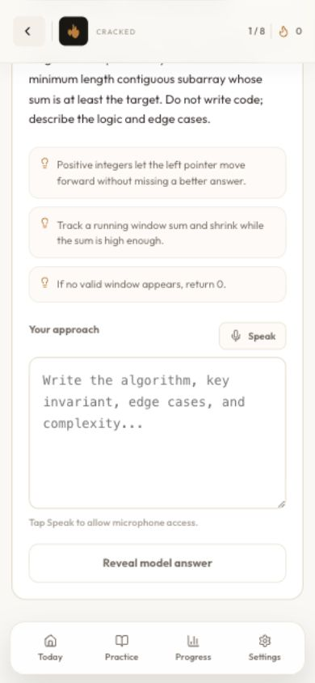

# 🎯 CrackIt — CS Placement Prep App

CrackIt is a premium, high-fidelity mobile and desktop companion app designed to help Computer Science students prepare for technical interviews and placement tests. Rather than a generic quiz platform, CrackIt operates as a **daily retrieval-practice system** utilizing spaced-repetition logic tailored for CS fundamentals and DSA reasoning.

Built as a single-page React app, it is packaged with **Capacitor** for iOS and includes a custom native macOS wrapper. It supports fully offline local progress persistence as well as optional cross-device cloud progress synchronization.

---

## 📱 App Walkthrough & Visuals

Here is a visual overview of CrackIt's user experience (optimized for mobile and iOS layouts):

### Core App Screens (Dashboard, MCQ Explanation, DSA Drills)
<p align="center">
  
  
  
</p>


---

## ⚡ Core Features

- **Spaced Repetition Engine:** Tracks mastery per-concept (`ease`, `interval`, `dueAt`, `reps`, `lapses`) so you review concepts at the optimal time.
- **Deep Explanations:** Every wrong answer (distractor) explains the exact misconception, and correct answers provide detailed memory hooks, code samples, and lessons.
- **Interactive Concept Drills:** Hands-on exercises and logical puzzles to test core system designs and algorithms.
- **DSA Self-Graded Reasoning:** Formulate algorithms, evaluate tradeoffs, and compare your reasoning against high-quality model answers.
- **Robust Progress Sync:** Fast SQLite Express backend with automatic LWW (Last-Write-Wins) sync to keep progress in sync across Mac, browser, and iOS.
- **Curated Subjects:**
  * 🗄️ Database Management Systems (DBMS)
  * 💻 Operating Systems (OS)
  * 🌐 Computer Networks (CN)
  * ☕ Object-Oriented Programming (OOP)
  * 🛠️ C++ & Python Programming Fundamentals
  * 🧠 Aptitude Reasoning / Logical Aptitude

---

## 🛠️ Tech Stack

- **Frontend:** React 19, Vite, Vanilla CSS (rich aesthetics, glassmorphism, responsive split-pane layout)
- **Mobile Wrapper:** Capacitor 8 (iOS)
- **Mac Wrapper:** Swift Native App Wrapper
- **Backend:** Node.js, Express, SQLite (for sync snapshots)

---

## 🚀 Getting Started

### Prerequisites
Make sure you have [Node.js](https://nodejs.org/) installed.

### Setup and Development

1. **Clone the repository:**
   ```bash
   git clone https://github.com/wofwoff/crack-it.git
   cd crack-it
   ```

2. **Install dependencies:**
   ```bash
   npm install
   ```

3. **Start the Frontend Dev Server:**
   ```bash
   npm run dev
   ```
   Open `http://127.0.0.1:5173` in your browser.

4. **Start the Sync Backend (Optional):**
   ```bash
   cd backend
   npm install
   APP_SHARED_SECRET=your-secret PROGRESS_DB_PATH=./data/progress.sqlite npm start
   ```

---

## 📱 Mobile (iOS) Build Commands

Use the following npm scripts to prepare and sync the Capacitor wrapper:

* `npm run ios:prepare` — Performs a production Vite build, updates assets, and copies the web bundle into the Xcode workspace.
* `npm run ios:sync` — Syncs native Capacitor configuration changes/plugins.
* `npm run ios:open` — Launches the project directly in Xcode.
